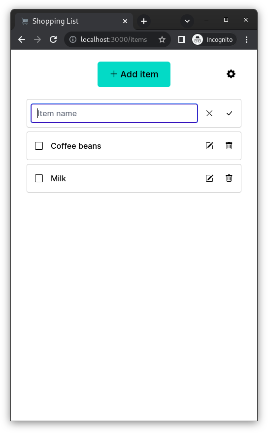
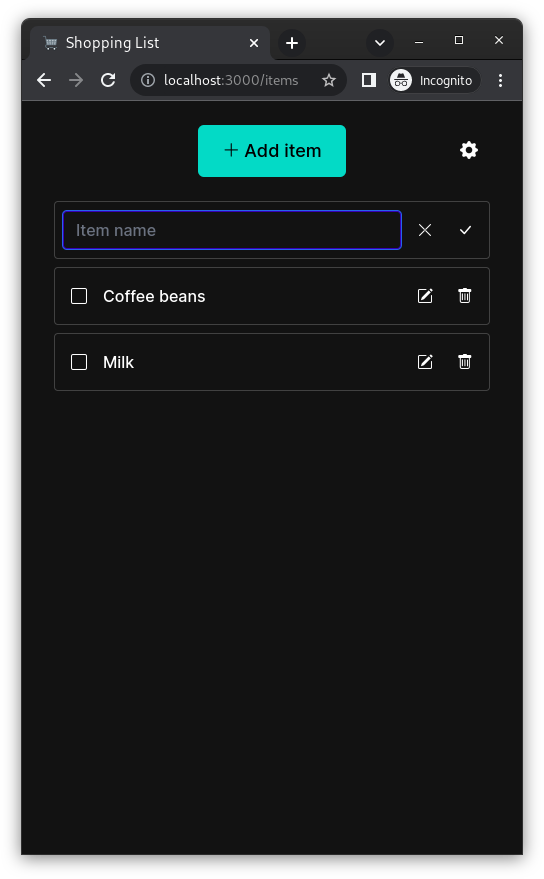
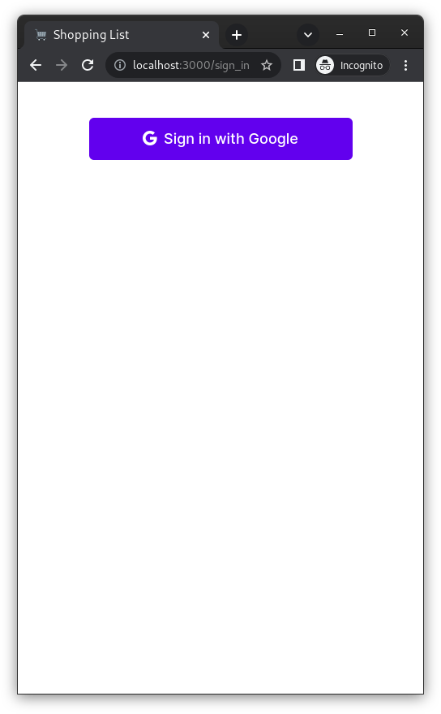
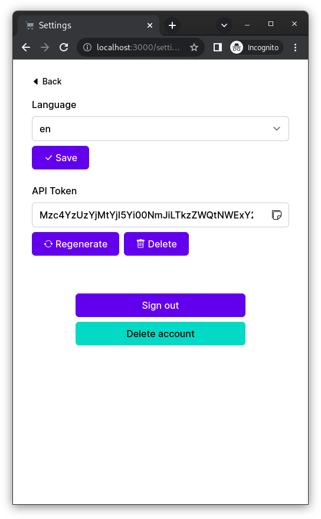
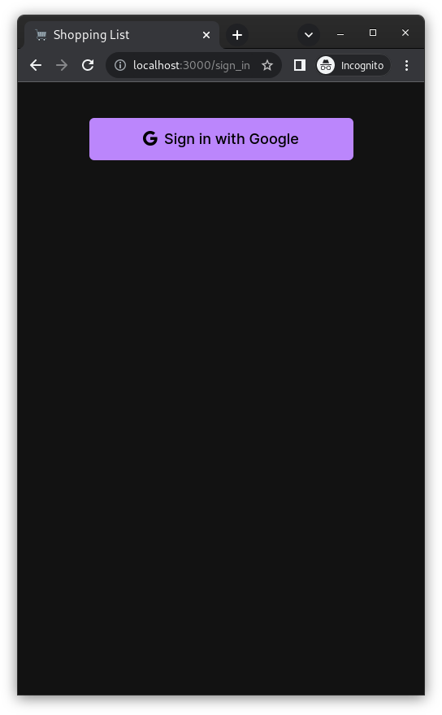
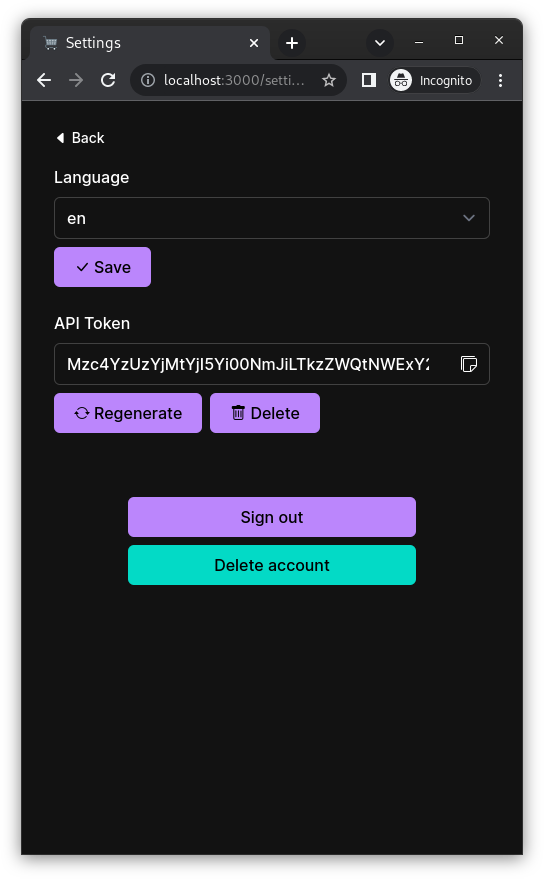

# Shopping List

[](https://github.com/hidakatsuya/shopping_list/actions/workflows/test.yml)

A simple web application to manage shopping list.
It is built with [Rails7](https://github.com/rails/rails) and [Hotwire](https://hotwired.dev/) and [Tailwind CSS](https://tailwindcss.com/).

- Sign up and sign in with Google account
- Managing items on shopping list
- Updating the completion status of items
- Dark mode support
- Multiple language support
- API for adding items: `POST /items`

<div>
  
  
</div>

<div>
  
  
  
  
</div>

## Related Products

- [Shopping List Android](https://github.com/hidakatsuya/shopping_list-android): An Android client for Shopping List
- [Shopping List CLI](https://github.com/hidakatsuya/shopping_list-cli): A command line interface for Shopping List

## Built With

- Ruby 3.2
- Rails 7.0
- Turbo (turbo-rails)
- Propshaft
- Tailwind CSS (tailwindcss-rails)

## Getting Started

These instructions will get you a copy of the project up and running on your local machine for development and testing purposes.

### Prerequisites

- Google OAuth Client
- Docker

### Installing

Copy .env.sample to create .env:

```
cp .env.sample .env
```

Then, set the client ID and secret key for Google OAuth client.

```
docker-compose build
docker-compose run app bin/setup
docker-compose up -d app tailwind
```

Visit http://localhost:3000.

## Running the tests

First, launch the chrome container.
```
docker-compose up -d chrome
```

Runnning unit tests:
```
docker-compose exec app bin/rails test
```

Running system tests:
```
docker-compose exec app bin/rails test:system
```

Running all tests:
```
docker-compose exec app bin/rails test:all
```

## License

This project is licensed under the MIT License - see the [LICENSE](LICENSE) file for details
